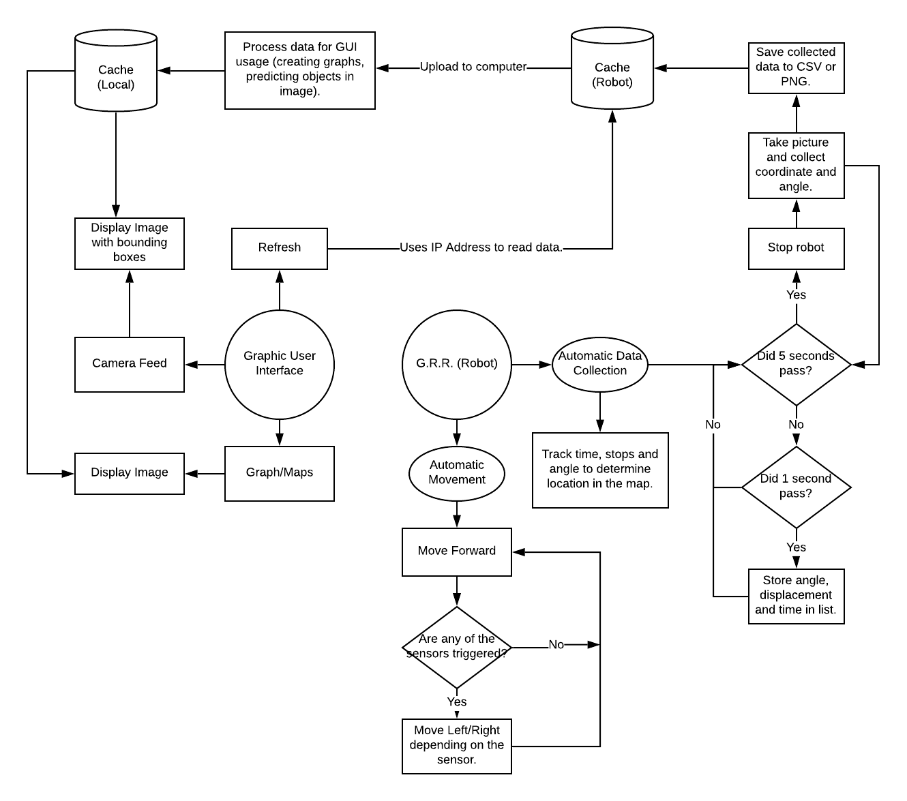

# G.R.R. - Geographic Roaming Robot
Robot that autonomously creates maps, storing information that the robot recieves through its camera input. It produces spreadsheet files (csv) for the user to analyze tracking the robot's movement within the map, as well as images taken by the robot. Some applications that this robot and GUI could do is determine population size in an enclosed region, creating labelled maps for the user, or viewing and mapping locations where the user could not access.

## Instructions
1. Install the following dependencies listed below.
2. Download any of the SSD512 weights provided in [this repository](https://github.com/pierluigiferrari/ssd_keras). Make sure these weights are loaded in the directory.
3. Copy python files in the RaspberryPi folder into your Raspberry Pi home folder.
4. To run the GUI for the robot, all you need to do is run the ``__init__.py`` file (the one that isn't in a package/folder).

## Running G.R.R.
1. Run the control panel, and make sure your raspberry pi and laptop is connected to the same network.
2. Open terminal, and type in ``ssh pi@<raspberry pi's IP address>``.
3. Type in ``sudo python3 RaspberryPi/GRR.py`` and the robot should start moving. A few seconds later, the control panel should be able to pick up data coming from the robot.
4. When done, press ``Ctrl+C`` while selecting terminal to stop the robot.

## Materials Used
* AlphaBot2-Pi
  * Infrared Sensors
  * RaspberryPi Camera
  * Motors
* Ultrasonic Sensors
* Compass

## Dependencies
* Python 3.x
* Pandas
* Pillow
* Javafx
* Numpy
* Tensorflow
* Keras
* Imageio
* wxpython

## Flowchart

## Credits
* Developed by Jan Garong and Matteo Tempo
* [ssd_keras](https://github.com/pierluigiferrari/ssd_keras) created by Pierluigi Ferrari
* [Find Heading by using HMC5883L interface with Raspberry Pi using Python](http://www.electronicwings.com) example code by electronicwings.
* [AlphaBot2.py](https://www.waveshare.com/) example code by waveshare.
